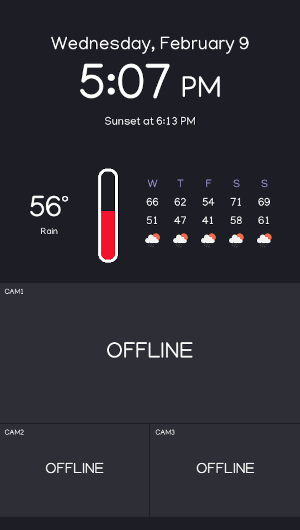
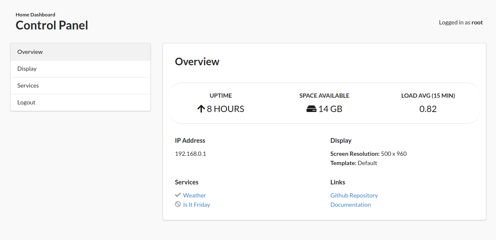

## Home Dashboard

I created this Python app using Pygame to display a clock and some weather information on a spare monitor.

In the future I will be adding the ability to show security camera video feeds, but for now these are just placeholders.

## Installing On a Raspberry Pi

### Hardware Requirements

I don't have a lot of information right now about minimum requirements, but I can say that I'm running this on a first generation model B with only 256MB of RAM. I haven't had any problems yet, but I have it running on a very low refresh rate (1 FPS). This is without playing video and without any performance tuning.

If you're buying a new device I think a Raspberry Pi 4 Model B with at least 2GB of RAM would be an acceptable starting point.

### Installing OS

I'm using a stripped-down version of Raspbian without the GUI because the full OS wouldn't run on my device. You can find information about installing the Raspberry Pi OS (previously Raspbian) here if you're using a newer model:

[Raspberry Pi OS](https://www.raspberrypi.com/software/)

### Getting API Key from Open Weather Map

To display weather data, you will need to register for at least a free account with Open Weather Map to get an API key.

Go here to view plans and select "Get API Key" under the free plan:

[Open Weather Map API](https://openweathermap.org/price)

### Installing the Home Dashboard App

You can either download the files or clone the repository to your Raspberry Pi by going to:

[https://github.com/aalcala07/home_dashboard](https://github.com/aalcala07/home_dashboard)

Open up the terminal to begin the installation process from within the `home_dashboard` directory:

1. Install venv:
```
sudo apt-get update
sudo apt-get install python3-venv
```
2. Create venv and activate
```
python3 -m venv venv
source venv/bin/activate
```
3. Install packages
```
pip install -r requirements.txt
```
4. Copy example config
```
cp .env.example .env
```
5. Edit the `.env` file and copy your API key to `OPEN_WEATHER_MAP_API_KEY`
6. Change the `LOCATION_LAT` and `LOCATION_LONG` (go to Google Maps and right click your city or any point on the map to get coordinates)
7. Change the `SCREEN_WIDTH` and `SCREEN_HEIGHT` to match your screen resolution
8. Launch the app:
```
python main.py
```

## Control Panel



You can view information about your device in the control panel. This feature is disabled by default. To enable it just set `ENABLE_CONTROL_PANEL=1` in your `.env` file and relaunch the app. 

Once the app launches, the control panel will be accessible from anywhere on your network, simply navigate to the correct IP address in your browser and make sure to add port `5000`.

<blockquote><b>IP Address</b>: Set <code>SHOW_DEVICE_INFO=1</code> in your <code>.env</code> to show your IP address on the bottom of your display.</blockquote>

For example, if your device's IP address is `192.168.0.1`, you would need to enter `http://192.168.0.1:5000` in your browser of choice. Once there, set your password and you will be automatically logged in. (This password is stored separately from the password you use to log into your Pi and does not need to be the same.)

<blockquote><b>Forgot your password?</b>: To reset your password, first find the <code>root</code> file in the <code>web/.passwords</code> folder and delete it. Then go back to the control panel and enter your new password.</blockquote>


## Customizing

The following settings can be changed in the `.env` file without writing any code:

- `SCREEN_WIDTH ` - The width of area where the app is displayed
- `SCREEN_HEIGHT` - The height of area where the app is displayed
- `GRID_MARGIN` - The left and right margins in pixels for some components
- `ICON_SCALE` - The size of the icons (acceptable values include 1 or 2)
- `FONT_SCALE` - Affects the size of all fonts by scaling them up or down
- `FONT_NAME` - The font name used for all fonts
- `FPS` - The number of frames per second (refresh rate)
- `SHOW_MOUSE` - Shows mouse cursor
- `DEBUG_GRID` - Shows colored grid for debuging
- `OPEN_WEATHER_MAP_API_KEY` - The API Key used to get weather data from the Open Weather Map API
- `LOCAL_LAT` - The latitude value used when getting weather data from Open Weather Map API
- `LOCAL_LONG` - The longitude value used when getting weather data from the Open Weather Map API
- `UPDATE_ON_STARTUP` - Whether to trigger the update function on all services at startup
- `TEMPLATE_CONFIG_FILE` - Specifiy which file to use for the template config. All custom templates must go inside of the `/templates` folder.
- `SERVICES_CONFIG_FILE` - Specify which file to use for the services config.

## Getting Weather for Multiple Locations

By default, weather data is retrieved for only one location. You can retrieve data for multiple locations by adding to the `services.json` file.

Under locations, add another object to the array like so:

```
"locations": [
    {
        "name": "local"
    },
    {
        "name": "chicago",
        "lat": 41.97571706813654,
        "long": -87.71617764143481
    }
]
```

You can also add the coordinates in the `.env` if you don't want to add them to `services.json` so that they aren't version controlled:

```
chicago_lat=41.97571706813654
chicago_long=-87.71617764143481
```

Finally, update the `location` field for second weather component in `template.json`.

<blockquote><b>Note</b>: An API request is sent for each location, so you may want to adjust <code>update_interval_seconds</code> in <code>services.json</code> to avoid throttling.</blockquote>

### Making Code Changes

You should create a fork of the repo if you want to make changes. You may also want to create a deploy key to make it easier to pull changes to your Raspberry Pi if you are editing code on another computer.

Here's some information on creating forks and deploy keys:

- [Github Docs - Fork a Repo](https://docs.github.com/en/get-started/quickstart/fork-a-repo)
- [Github Docs - Managing Deploy Keys](https://docs.github.com/en/developers/overview/managing-deploy-keys)

### Creating a Component

You can add your own component my creating a Python module in the `components` directory and then registering it in `template.json`. All components must have a `draw` function that accepts thre arguments (`screen`, `rect`, and `props`) at a minimum. You can look at existing components to see how this is done.

### Registering Component

To display the component on the screen you need to add it to the `template.json` file. The file consists of rows each containing one or more column. Each column within a row contains the component.

Here is the row containing the Clock component, for example. 

```json
{
    "rows": [
        {
            "height": "4/16",
            "use_margin": true,
            "columns": [
                {
                    "width": "1",
                    "component": "clock",
                    "props": {
                        "location": "local"
                    }
                }
            ]
        }
    ...
    ]
}
```

- `height`: Sets the height as a fraction of the screen height.
- `use_margin`: Adds a left and right margins to the row when set to `true`.
- `columns`: Array of columns displayed from left to right in a row. Within each column the `width` field defines the width of the column as a fraction of the row width, while the `component` field defines the name of the component to be displayed. The `props` field is for any option properties you want to pass to the component.

To have two components show side by side set the columns to:

```json
"columns": [
    {
        "width": "1/2",
        "component": "component_one"
    },
    {
        "width": "1/2",
        "component": "component_two"
    }
]
```